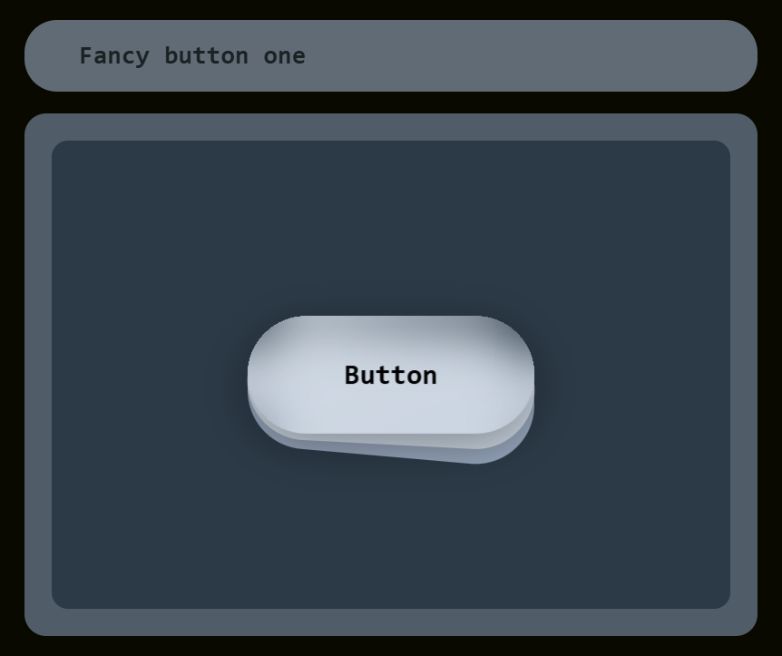

# Fancy Button One - Interactive Button Component with Framer Motion

This repository contains an interactive and visually appealing button component built using **React** and **Framer Motion**. The "Fancy Button One" component demonstrates smooth animations on hover and click events, providing a modern and dynamic user experience.

[](./fancyButtonOne.mp4)


## Features

- **Hover Animation**:
  - When the user hovers over the button, it scales up slightly.
  - The background divs rotate dynamically to create a layered effect.

- **Click Animation**:
  - On click, the button and its background layers shrink and align perfectly, with all rotations resetting to `0`.

- **Responsive Design**:
  - The button and its layers are styled using **Tailwind CSS**, making it adaptable to different screen sizes and designs.

- **Spring Transition**:
  - All animations leverage Framer Motion's spring transitions, ensuring smooth and natural movement.

## Key Technologies

- **React**: For building the component's structure and managing states.
- **Framer Motion**: For handling complex and seamless animations.
- **Tailwind CSS**: For styling and responsive layout.

## How It Works

### Hover Interaction
- The `motion.div` and `motion.button` detect hover events using `onHoverStart` and `onHoverEnd`.
- The button scales up (`scale: 1.1`), and the background layers rotate slightly.

### Click Interaction
- The button detects click events using `onClick` to toggle its state.
- On click, the layers behind the button animate to align (`top: 17px`, `rotate: 0`) while the entire structure shrinks (`scale: 1`).

### Customizable Styles
- The component uses Tailwind CSS for consistent styling.
- Modify classes or animation parameters to fit your design.

## Installation and Usage

1. Clone the repository:
   ```bash
   git clone https://github.com/yourusername/fancy-button-one.git
   cd fancy-button-one
   ```

2. Install dependencies:
   ```bash
   npm install
   ```

3. Run the app:
   ```bash
   npm start
   ```

4. Customize the component as needed in `FancyButtonOne.jsx`.

## Demo

Check out how the button responds to user interactions:
- **Hover**: Subtle scaling and rotation effects.
- **Click**: Shrinks and aligns layers for a seamless look.

## Folder Structure

```
.
├── src
│   ├── components
│   │   └── FancyButtonOne.jsx  # Main component file
│   ├── App.js                  # Application entry point
│   ├── index.js                # React DOM rendering
│   └── styles.css              # Custom Tailwind CSS styles (optional)
├── package.json
├── README.md
└── ...
```

## Contributing

Contributions are welcome! Feel free to fork this repository and submit a pull request with your improvements or feature ideas.

## License

This project is licensed under the [MIT License](LICENSE).

---

Feel free to use, customize, and share this Fancy Button component for your projects! 🚀

